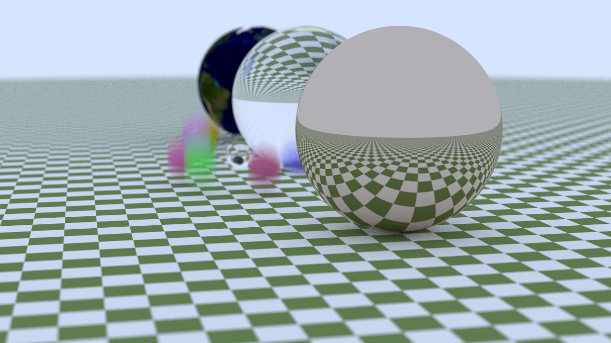
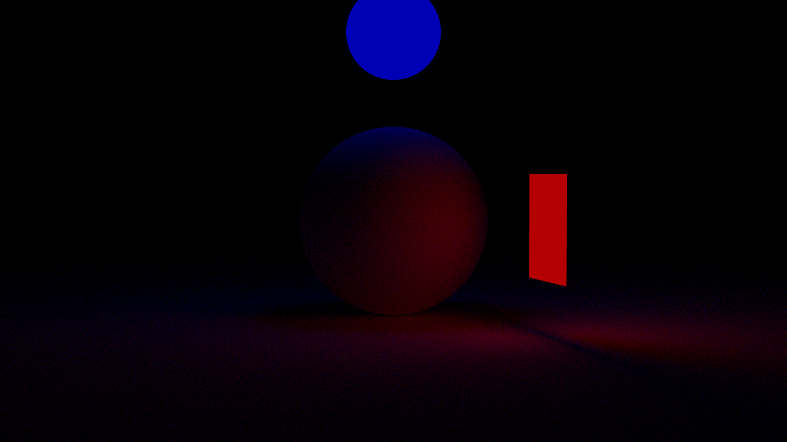
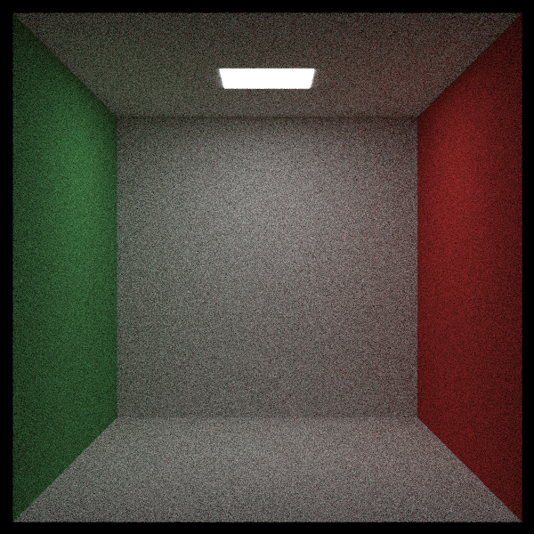

# Ray Tracer The Next Week ( WIP )

This is an improved version of [Ray Tracer In One Weekend](https://github.com/irrevocablesake/Ray-Tracer-In-a-Weekend). It's still a WIP, but the so far completed features are as follows:

## Features

### Motion Blur, BVH, Textures

  
   
  <em>A Hero Render</em>

**Motion Blur:** Motion blur is a visual effect that simulates the streaking or blurring of moving objects in a scene, caused by the relative motion between the camera and objects during the exposure time of a frame. In our case, the camera always stays stable and the object moves, this movement is described by assigning two positions to our desired object: the start position and the end position

**BVH:** A BVH (Bounding Volume Hierarchy) is a tree structure used to accelerate ray tracing by organizing scene geometry into nested bounding volumes, enabling efficient ray-object intersection tests. Earlier, without BVH, the **Hero Render** from [Ray Tracer In One Weekend](https://github.com/irrevocablesake/Ray-Tracer-In-a-Weekend) took nearly 14 hours to render but with BVH acceleration it took just around 1 hour

**Textures:** Textures are merely images that are applied over object to make them look more interesting, we have included two ways to use textures, one is to procedurally generate and the second is to use image textures.

### Lights

Lights, in addition to the global illumination, there are proper light sources. This has been implemented as a Material, so all one has to do is create a geometry and just apply the material and viola ~ it will shine bright :)

In this example, we have used 2 lights, red light and blue light but one can see a purplish light can be seen on the floor due to the nature of interaction of light. For a more white colour light, please see the next Cornell Box example

  
   
  <em>Red Blue Lights</em>

### Cornell Box

<table>
  <tbody>
    <tr>
      <td >
        
        

          Cornell Box
        

      </td>
      <td>
        

          A Cornell Box is a standard 3D test scene with a simple room, colored walls, and a light source, commonly used to evaluate global illumination, light transport, and rendering algorithms
        

      </td>
    </tr>
  </tbody>
</table>

